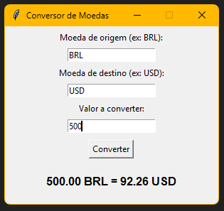

# Conversor de Moedas com Interface Básica (Python)

*Conversor de moedas* simples, conectado a uma API gratuita (https://freecurrencyapi.com/) e com uma interface gráfica básica.

---

## Funcionalidades

- Interface gráfica simples e intuitiva
- Conversão entre qualquer par de moedas (ex: BRL → USD, EUR → JPY)
- Taxas de câmbio atualizadas
- Validação de campos

---

## Interface



---

## Execução:

### Pré-requisitos
- Python 3.x instalado
- Biblioteca `requests` instalada

```
pip install -r requirements.txt
```

### Instalação:

Clone o repositório:
```
git clone https://github.com/MateusAndradePor/ConversorMoedas.git
cd ConversorMoedas
```
